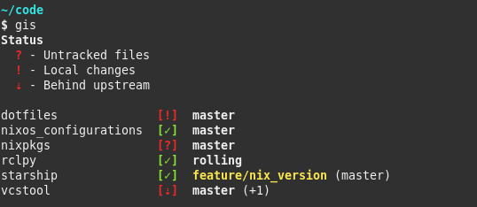

#+title: gis
#+subtitle: Get status information about multiple Git repositories

/gis/ is a Bash script which shows a status summary of multiple Git repositories.

It was inspired by [[https://wiki.ros.org/wstool][wstool]], [[https://github.com/dirk-thomas/vcstool][vcstool]] and the default [[https://starship.rs/][Starship]] prompt.

* Usage

#+begin_example
  Usage: gis [OPTIONS] [COMMAND]

  Show a status summary of all Git repositories which are found recursively in
  current work directory. The colon colon-separated environment variable
  $GIS_PATH or the '-p' argument can be used to modify the search path.

  All 'fetch' and 'pull' operations are executed in parallel. The number of
  background jobs can be limited with the environment variable $GIS_JOBS or the
  '-j' argument.

  COMMANDS
    fetch  Execute 'git fetch --prune --all' for all found repositories
    pull   Execute 'git pull --recurse-submodules' for all found repositories
             which are behind upstream, includes 'gis fetch'

  OPTIONS
    -j, --jobs  N     Limit 'fetch' and 'pull' commands to N parallel jobs
    -p, --path  PATH  Use PATH for searching Git repositories
    -h, --help        Show this help message and exit
#+end_example

* Dependencies

- At least Bash =v4=
- BSD =column=
- Git

* Installation

** Manual

Place the =gis= script in your =$PATH=.
To use the autocompletion feature source the =gis_completion.bash= script.

*** ZSH

On ZSH additionally the =compinit= and =bashcompinit= modules must be loaded before sourcing the completion script:

#+begin_src sh
  autoload -U +X compinit && compinit
  autoload -U +X bashcompinit && bashcompinit
#+end_src

** Scripts

Installation scripts for Bash (=install.bash=) and ZSH (=install.zsh=) are provided which will link the two files from the current repository to =~/.local/{bin/gis,share/bash-completion/completions/gis}= and add the corresponding entries to =~/.bashrc= or =~/.zshrc=.
Further updates of /gis/ require just =git pull= in the /gis/ repository.

** Nix Flake

This repository is also a [[https://nixos.wiki/wiki/Flakes][Nix Flake]].
/gis/ is provided as package under =github:Deleh/gis#gis=.

* Configuration

The default behavior can be adjusted with the following environment variables:

| Variable   | Description                                                                                                                                                            | Example Value          |
|------------+------------------------------------------------------------------------------------------------------------------------------------------------------------------------+------------------------|
| =GIS_PATH= | Colon seperated list of paths. If set, they will be used as default search paths instead of the current work directory. Can be overwritten with the =--path= argument. | =$HOME/git:$HOME/code= |
| =GIS_JOBS= | Limit for the number of parallel =fetch= and =pull= jobs.                                                                                                              | =10=                   |

* Syntax

** Status Keys

#+begin_example
  $ - Dirty stash
  ? - Untracked files
  ! - Local changes
  + - Staged changes
  - - File removed
  » - File renamed
  = - Both modified
  ⇕ - Diverged from upstream
  ⇡ - Ahead upstream
  ⇣ - Behind upstream
  ✗ - Upstream gone
#+end_example

** Branches

Branches which don't have the same name as the =origin/HEAD= reference are highlighted in yellow.
You can manually check on which branch you working tree is on by executing the following command:
: git symbolic-ref refs/remotes/origin/HEAD

Note, that the reference gets only set when the repository is initially cloned and doesn't update with =git fetch=.
It can be updated like this:
: git remote set-head origin -a

Or set it manually to any branch with:
: git remote set-head origin <branch_name>

The number of additional local branches which are neither checked out, nor the =origin/HEAD= branch, is appended at the end of the branch output, e.g. =(+8)=.
